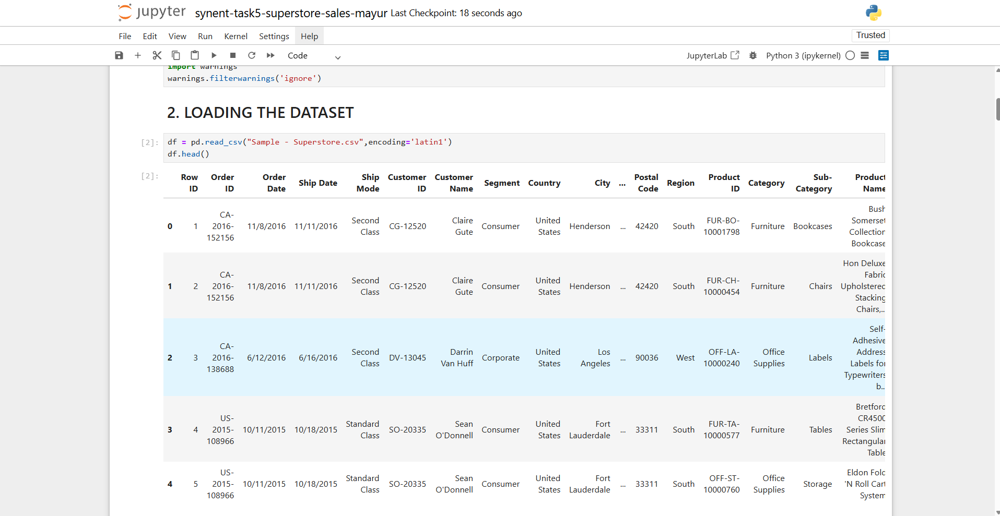
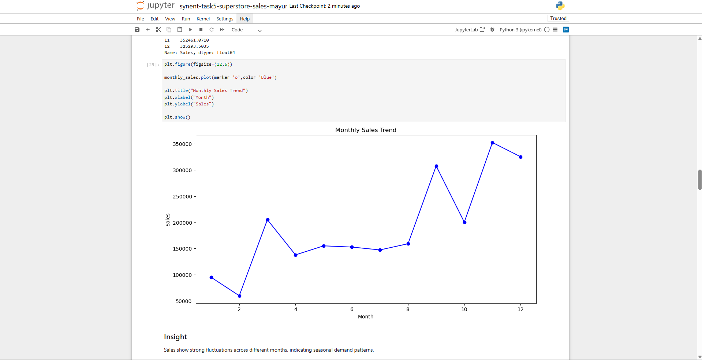
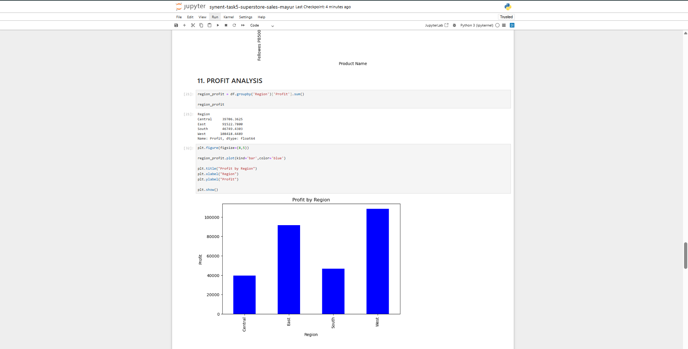
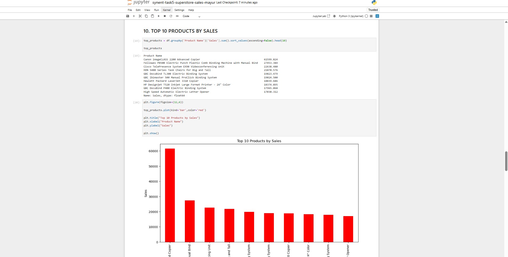
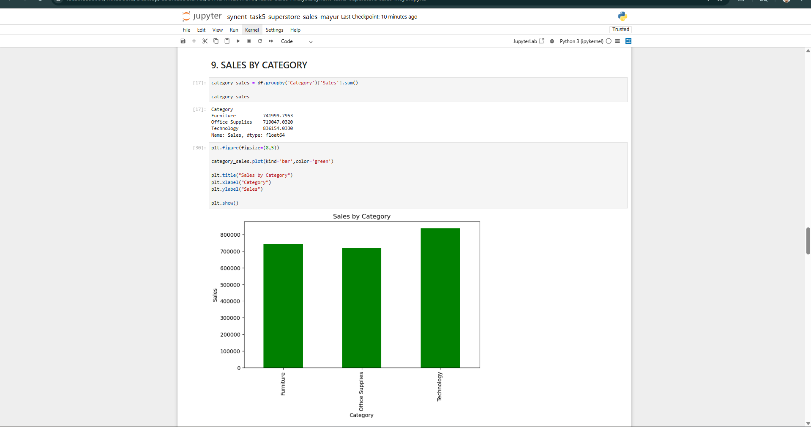

# 📊 Superstore Sales Analysis Project

## 📌 Objective
The objective of this project is to analyze Superstore sales data and identify business insights, sales trends, and profit patterns.

---

## 🛠 Technologies Used
- Python
- Pandas
- NumPy
- Matplotlib
- Seaborn

---

## 📂 Dataset
Superstore Sales Dataset

---

## 📈 Analysis Performed
- Monthly Sales Analysis
- Profit Analysis
- Top Selling Products
- Category-wise Sales
- Data Visualization

---

## 📊 Visualizations
- Bar Charts
- Line Charts
- Heatmaps
- Sales Analysis Charts

---

## ▶ Project Workflow
1. Data Cleaning  
2. Data Preprocessing  
3. Exploratory Data Analysis  
4. Data Visualization  
5. Insights Generation  

---

## 📌 Results
The project helped identify sales trends, profitable categories, and business performance insights.

---

## 📸 Project Screenshots

### Dataset Preview

### Monthly Sales Analysis

### Profit Analysis

### Top Selling Products

### Category-wise Sales

---

## 👨‍💻 Author
Mayur Bavaskar
